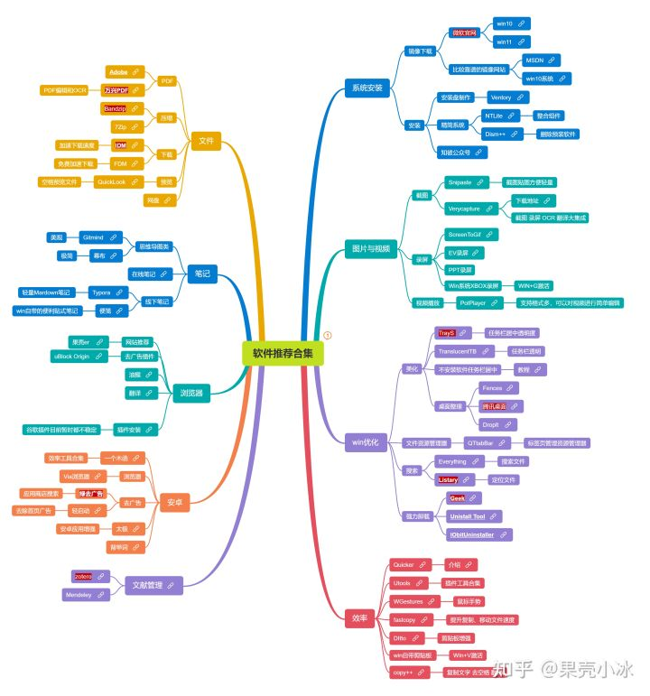
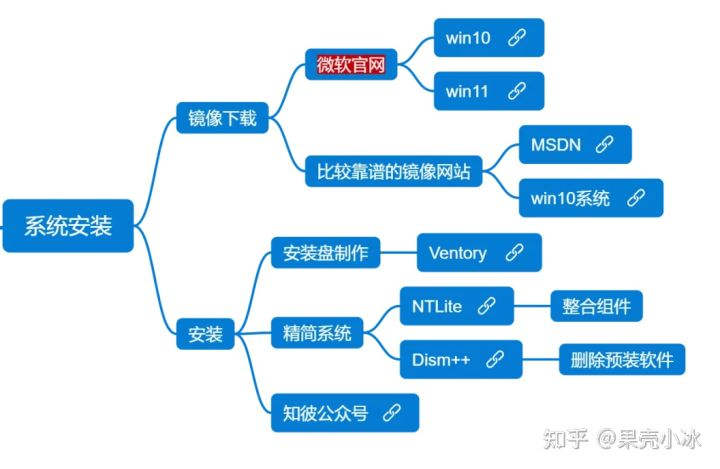
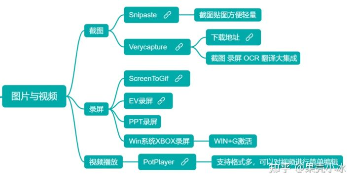
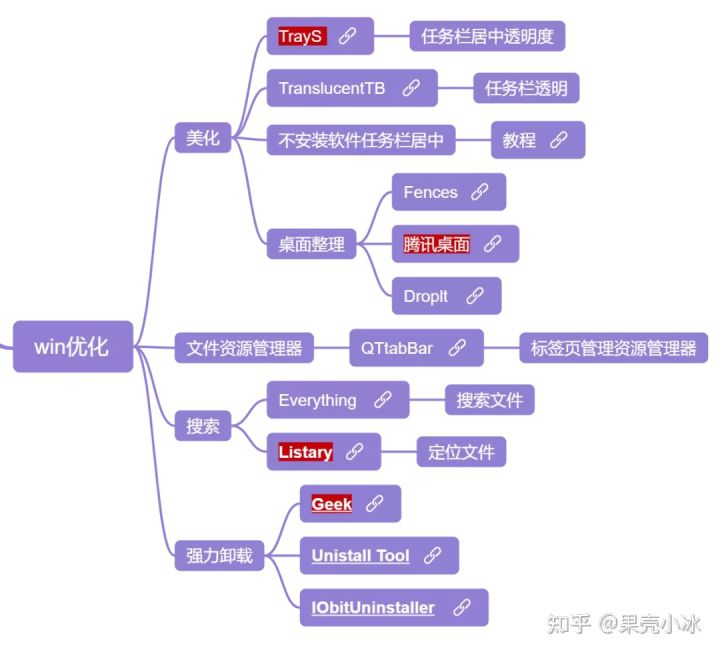
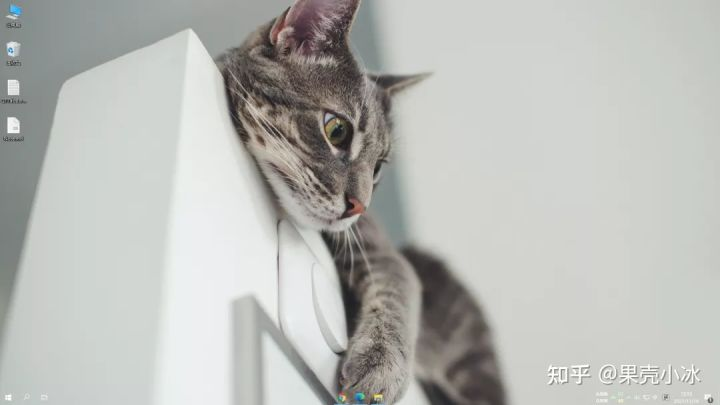
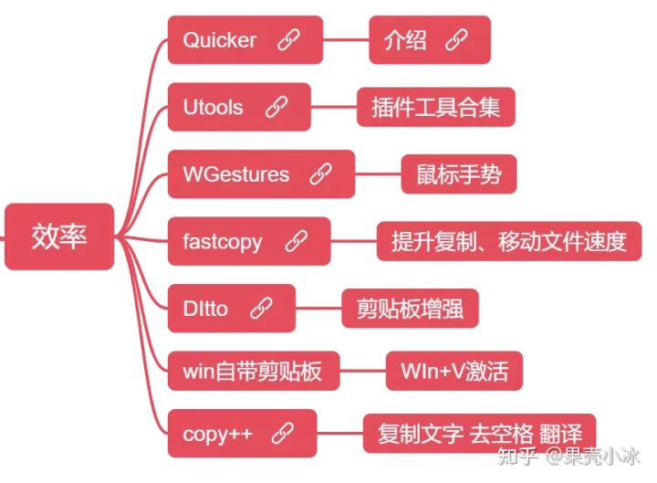
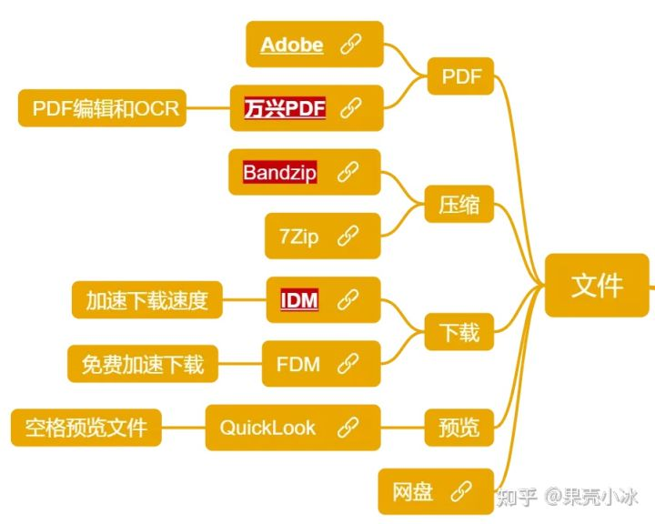
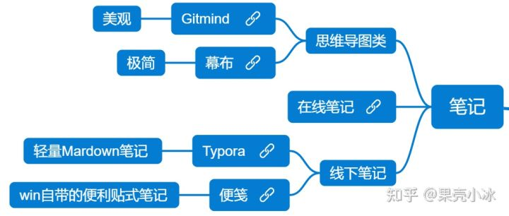
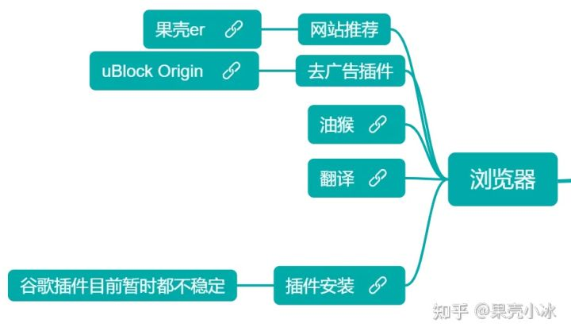
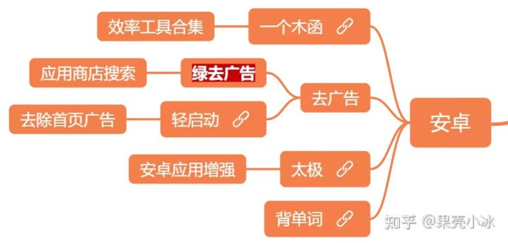

文章首发于公众号 【国科大吃喝玩乐学】

今天，小冰把自己压箱底的软件都整理出来了，一起分析给大家，废话不多说，上图。

GitMind链接：       [软件推荐合集 ](https://gitmind.cn/app/doc/9dd3910819)

点击上述链接即可查看原图，点击思维导图中的链接就可以转到软件官网。

由于本次推荐的软件过多，不可能使用一次推文挨个介绍，因此小冰在这里就对软件进行大概的介绍，如果你对某个软件感兴趣可以在网上搜索相应资源和教程。

## **01 系统安装类**

很多电脑小白觉得系统安装是件高大上的事情，其实安装系统非常简单，主要分为三步：**镜像下载、启动盘制作、系统激活。**

Win系统镜像下载一般选择微软官网即可，而且官网有相应的教程，如果你只想要**在本机装系统**，按照它的教程走就可以，和安装软件没有太大区别。

如果你需要在**别的电脑上安装系统**，目前**Win10官网提供了制作Win10启动盘的方法**，如果你只需要一个系统镜像，按照官网走也没有问题。

如果你需要**非最新的镜像**，你可以在图中两个网站寻找，如果你需要**多个镜像文件**，传统方法是制作WinPE系统盘，但小冰推荐使用**Ventory工具制作启动盘**，只需要将镜像文件拖入U盘就可以搞定了。

**U盘安装系统**只需要进入BIOS界面，选择启动方式，接着按照提示按照系统即可。这一步可以找一下相关教程。安装过程其实除了UI与普通应用程序不一样外，并没有太大区别。

最后的激活给大家推荐了一个公众号，大家去找相关软件即可。

## **02 图片与视频类**

截图软件，小冰之前推荐过Snipaste，Verycapture严格来说并不是截图软件，其将截图、录屏、OCR等功能集合在了一起，感兴趣的果壳er可以试一下。

对于录屏软件，除了用第三方软件外，Win系统自带的Xbox就可以实现录屏，当然PPT也可以进行录屏。

视频播放，这里就推荐了一款，PotPlayer支持格式多，还可以对视频进行简单编辑。

## **03 Win优化**

对于任务栏的美化，有两种解决方案：**直接使用TrayS或者TB+win系统的任务栏居中**，比较推荐使用TrayS，果壳er们根据自己的需求选择即可。

桌面文件整理推荐了三款软件，三款软件各有千秋，小冰比较推荐**腾讯桌面**。

Win系统的文件资源管理器最大的弊端就是不能像浏览器那样实现**标签页浏览**，而QTtabBar刚好可以解决这个问题。首先说明，能够解决这个问题的有很多软件，但是最后从使用舒适度和稳定性方面，这款软件是小冰用得最顺手的，因此只推荐这一款。

Win自带的文件搜索效果也不是很好，不全而且速度慢，这里推荐的两款软件，相比较而言小冰更推荐Listary，付费版体验更佳。

日常卸载，Win系统的控制面板就够用了，但**控制面板不能卸载注册表等信息**，因此小冰这里推荐了三款强力卸载工具，这三款都有付费内容，体验下来，小冰推荐使用**Geek工具**，其免费版就够用了。Geek小巧轻便但有一个比较明显的缺点，不支持多个软件同时卸载。

对于Win系统的美化，小冰的解决方案是T**rayS任务栏美化+全屏开始菜单+Listary搜索文件**，只在桌面放置极少图标，需要文件编辑时直接Listary搜索。

## **04 效率**

效率软件这里，Quicker和Utools比较类似，都是一些插件或者动作的集合，WGestures是一款增强鼠标手势的软件，有了它，你可以鼠标划来划去去完成一定的任务。

## **05 文件**

PDF文件阅读与编辑，Adobe由于是老牌大厂，稳定性和适用性是最好的，万兴PDF功能强大，因此这里推荐这两款PDF软件。当前这两款软件的编辑功能都需要付费

压缩软件，首推Bandzip，7Zip也不错，可以都体验一下。

下载工具IDM体验最佳，但需要付费使用，FDM可以免费加速，但是缺乏维护。

QuickLook软件可以快速预览文件内容，在微软商店即可下载，如需预览office文件，需要安装相关插件。

## **06 笔记**

针对思维导图，小冰推荐了两款，**Gitmind**更适合制作小段文字，注重美观的思维导图，**幕布**相对来说比较简约，但可以将大段文字作为节点。幕布的免费版单个文件的节点数量有限制，不过一般够用。

线下笔记**Typora**是极简的Maedown笔记，而win系统自带的**便笺**比较类似便利贴的感觉，可以悬浮在桌面上。

## **07 浏览器**

小冰之前介绍过有关浏览器的一些插件，这里就不作过多介绍，需要说明一点的是，最近一些免费访问谷歌的插件基本不能使用了，大家如果需要访问谷歌可能需要想其他办法了。

这里着重介绍一款去广告插件，虽然网上很多推荐别的插件的，最著名的就是两款A开头的插件，但是小冰安装后体验并不是很好，**uBlock去广告效果最好，还可以自定义规则。**

## **08 安卓**

安卓去广告的两款软件，对于APP启动页广告都有不错的效果，推荐尝试。

**via浏览器**是安卓端最为轻快的浏览器，你很难想象如今的安卓还存在一款体积小于1M的APP。主页面一个搜索框，所见即是浏览器最为根本的功能，没有其它臃肿的功能，追求极致的简约。

太极软件是一款神器，果壳er们都知道，安卓手机ROOT后可以实现很多功能，而这款软件可以让你免ROOT就实现一定的功能，喜欢折腾的小伙伴可以试试。

## **09 文献管理**

文献管理的软件，小冰之前详细对比过，首推Zotero，但是当时没有对比Mendeley，这款软件也不错，感兴趣可以试试。

[文献管理软件测评 Endnote Noteexpress Zotero Citivai ](https://zhuanlan.zhihu.com/p/348608795)

**注意**

图中具有相同功能的软件**标有底色的为首推**，其它软件并不是不好，能够放在这里肯定是在某一方面有一定的优势，或许它的优势正好是果壳er需要的，果壳er根据需要选择就好。

具有**下划线的软件需要付费使用或者部分功能需要付费**使用，当然这些软件肯定都有相应的免费获取渠道，大家如果需要可以网上找找看，如果实在找不到可以后台询问小冰，小冰看到会及时回复的。
